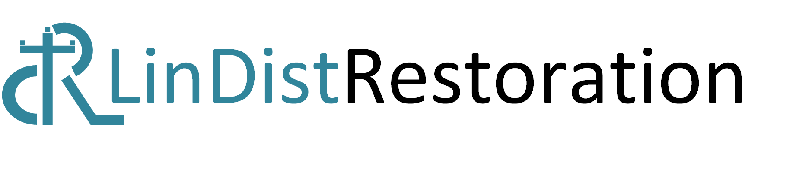

# 

> [!Note]
> The package is currently in a development state and will have several code pushes in the next few weeks or so. Please use the current version carefully and keep updated with the code updates.

LinDistRestoration is a package that solves a 3-phase unbalanced distribution system restoration problem using mixed-integer linear programming. This package is intended for users interested in solving linear optimal power flow problems. The linear power flow model is extracted from [[1]](#ref1) and the base restoration models are based on [[2]](#ref2), [[3]](#ref3).

# Getting started
Please follow this online <a href="https://abodh.github.io/LinDistRestoration/" target="_blank">documentation</a> to get started with LinDistRestoration.

## References
{#ref1}
[1] L. Gan and S. H. Low, "Convex relaxations and linear approximation for optimal power flow in multiphase radial networks," 2014 Power Systems Computation Conference, Warsaw, Poland, 2014, pp. 1-9.

{#ref2}
[2] A. Poudyal, S. Poudel and A. Dubey, "Risk-Based Active Distribution System Planning for Resilience Against Extreme Weather Events," in IEEE Transactions on Sustainable Energy, vol. 14, no. 2, pp. 1178-1192, April 2023.

{#ref3}
[3] S. Poudel, A. Dubey and K. P. Schneider, "A Generalized Framework for Service Restoration in a Resilient Power Distribution System," in IEEE Systems Journal, vol. 16, no. 1, pp. 252-263, March 2022.
